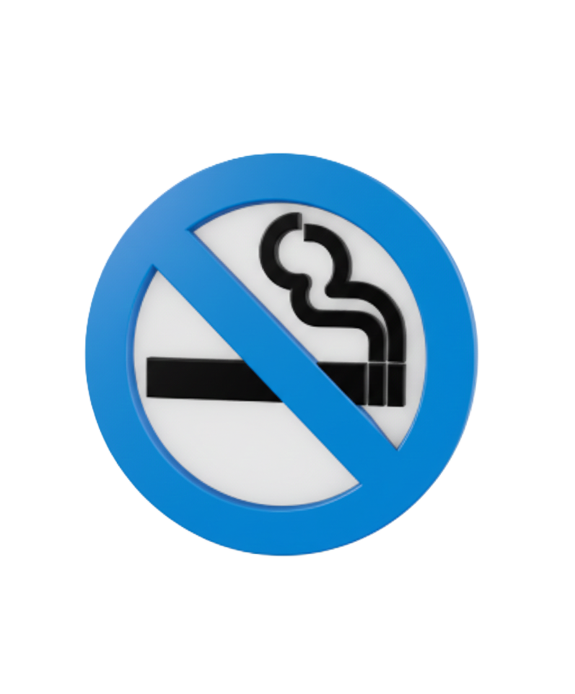

<p align="center">
  
</p>

<h1 align="center">🚭 No Smoke Journey</h1>

<p align="center">
  <b>A Comprehensive Smoking Awareness & Cessation Platform</b>
</p>

<p align="center">
  <a href="#"></a>
  <a href="#"></a>
  <a href="#"></a>
  <a href="#"></a>
  <a href="#"></a>
  <a href="#"></a>
  <a href="#"></a>
</p>

<p align="center">
  <a href="#features">Features</a> •
  <a href="#tech-stack">Tech Stack</a> •
  <a href="#system-architecture">Architecture</a> •
  <a href="#project-structure">Structure</a> •
  <a href="#installation--setup">Setup</a> •
  <a href="#api-overview">API</a> •
  <a href="#authentication--security">Security</a>
</p>

---

## 📖 Overview

**No Smoke Journey** (branded as **LungCare**) is a full-stack web application designed to help individuals quit smoking through awareness, assessment tools, professional support, and community engagement. Built as a graduation project, it demonstrates enterprise-grade architecture with clean separation of concerns, JWT-based security, and a responsive user interface.

The platform combines **scientific health assessments**, **AI-powered symptom checking**, **doctor directory services**, **educational content**, and **community recovery stories** — all within a unified, role-based ecosystem serving Users, Doctors, and Administrators.

---

## 🎨 UI/UX Design

> **Figma Design:**
> https://www.figma.com/site/CA8CbtzaSXVNiKd90YC3cj/HealthCare?node-id=0-1&t=OGNSPoMj0PRs2V5m-1

The frontend follows a modern, health-focused design language with calming blue gradients, clean typography (Inter, DM Sans, Syne), and fully responsive layouts optimized for both desktop and mobile experiences.

---

## ✨ Features

### 🔐 Authentication & Authorization
- JWT-based authentication with Bearer tokens
- Role-based access control: **User**, **Admin**, **Doctor**
- Password hashing with BCrypt
- Secure token persistence in localStorage
- Protected routes with auth guards

### 👤 User Management
- User registration with email validation
- Login with role-based redirection
- Profile completion and management
- Password reset via OTP verification
- Logout with token cleanup

### 🫁 Health Assessment Tools
- **Nicotine Addiction Test** — Fagerström model with 6 questions to determine dependency level
- **Cancer Risk Assessment** — Evaluates lung cancer risk based on smoking history and symptoms
- **Progress Tracker** — Tracks smoke-free days, cigarettes avoided, money saved, and health improvements
- **Quit Timeline** — Visual timeline of health recovery milestones (20 minutes to 15 years)
- **Cashup Calculator** — Calculates money saved since quitting

### 🧠 AI Symptoms Checker
- Self-assessment tool for evaluating cancer risk based on user-reported symptoms
- Personalized recommendations based on assessment results

### 👨‍⚕️ Doctor Directory
- Browse specialist doctors (Pulmonology, Oncology, Smoking Cessation)
- Doctor profiles with specializations, schedules, and contact info
- Medical centers with location-based search
- Reviews and ratings system

### 📚 Educational Content
- Articles, videos, and infographics
- Interactive body model — click organs to see smoking effects
- Content categorization by body organ (Lungs, Heart, Brain, etc.)
- Smoking awareness, lung cancer education, and common myths debunking

### 👥 Community Features
- **Recovery Stories** — Share and read success stories with admin moderation
- **Seminar Registration** — Register for upcoming awareness events and workshops
- Success story badges (3 Months, 6 Months, 1 Year, etc.)

### 🛡️ Admin Dashboard
- Real-time statistics polling (stories, users, doctors, hospitals)
- **Doctors Management** — CRUD operations for doctor profiles
- **Hospitals & Labs Management** — Manage medical center listings
- **Seminars Management** — Schedule and manage educational events
- **Stories Moderation** — Approve, reject, or delete user-submitted stories
- Modern toast notification system
- Confirmation modals for destructive actions

### 📱 UI/UX Features
- Fully responsive Bootstrap 5 design
- Hero section with typewriter animation
- Smooth fade-in animations
- Interactive dropdown navigation
- Auth toast notifications
- Registration modal for seminars
- Loading states on buttons

---

## 🛠️ Tech Stack

### Backend
| Technology | Version | Purpose |
|------------|---------|---------|
| .NET | 8.0 | Core framework |
| ASP.NET Core Web API | 8.0 | REST API |
| Entity Framework Core | 8.0 | ORM |
| SQLite | 3.x | Database |
| AutoMapper | 12.x | Object mapping |
| JWT Bearer | 8.0 | Authentication |
| BCrypt | Latest | Password hashing |
| Swagger | 6.4.0 | API documentation |

### Frontend
| Technology | Version | Purpose |
|------------|---------|---------|
| HTML5 | — | Markup |
| CSS3 | — | Styling |
| JavaScript (ES6+) | — | Interactivity |
| Bootstrap | 5.3.2 | UI framework |
| Google Fonts | — | Typography |

### DevOps & Tools
| Technology | Purpose |
|------------|---------|
| Docker | Containerization |
| Docker Compose | Multi-container orchestration |
| Git | Version control |
| Postman | API testing |

---

## 🏗️ System Architecture

### N-Tier Clean Architecture

```
┌─────────────────────────────────────────────────────────────┐
│                    Presentation Layer                        │
│              (NoSmokeJourney.API)                           │
│    - Controllers, Middleware, Static Files (wwwroot)        │
│    - Serves frontend SPA from wwwroot/index.html            │
├─────────────────────────────────────────────────────────────┤
│                    Business Logic Layer                      │
│              (NoSmokeJourney.Services)                      │
│    - Services, DTOs, Interfaces, AutoMapper Profiles        │
├─────────────────────────────────────────────────────────────┤
│                    Data Access Layer                         │
│           (NoSmokeJourney.Infrastructure)                   │
│         - DbContext, Repositories, Unit of Work             │
├─────────────────────────────────────────────────────────────┤
│                      Domain Layer                            │
│               (NoSmokeJourney.Core)                         │
│           - Entities, Enums, Interfaces                     │
└─────────────────────────────────────────────────────────────┘
```

### Design Patterns Implemented
- ✅ **Repository Pattern** — Generic repository with `IGenericRepository<T>`
- ✅ **Unit of Work Pattern** — Transaction management across repositories
- ✅ **Dependency Injection** — Scoped service registration
- ✅ **DTO Pattern** — Separation between domain models and API contracts
- ✅ **AutoMapper** — Object-to-object mapping between layers

### Request/Response Flow

```
HTTP Request
    ↓
Controller (API Layer) — JWT validation, model binding
    ↓
Service (Business Layer) — Business logic, DTO mapping
    ↓
Repository (Infrastructure) — Data access via EF Core
    ↓
SQLite Database
    ↓
Entity → DTO → JSON Response
```

### Frontend ↔ Backend Integration

The ASP.NET Core backend serves the frontend as static files:

```csharp
// Program.cs
app.UseDefaultFiles();  // Serves index.html for /
app.UseStaticFiles();   // Serves CSS, JS, images
app.MapFallbackToFile("index.html"); // SPA fallback
```

The frontend communicates with the backend via REST API calls using a configurable `apiRequest()` utility that supports both **REAL** mode (fetch to localhost:5000) and **MOCK** mode (localStorage-based mock data).

---

## 📁 Project Structure

```
finalproject_eelu--master/
│
├── 📂 NoSmokeJourney_Backend/          # ASP.NET Core Web API
│   ├── NoSmokeJourney.sln              # Solution file
│   ├── docker-compose.yml              # Docker orchestration
│   │
│   ├── 📂 NoSmokeJourney.API/          # Presentation Layer
│   │   ├── Controllers/                # API Controllers (Auth, Users, Doctors, etc.)
│   │   ├── appsettings.json            # Configuration (JWT, ConnectionStrings)
│   │   ├── Program.cs                  # App entry point, DI registration
│   │   └── wwwroot/                    # Frontend static files (served at runtime)
│   │
│   ├── 📂 NoSmokeJourney.Core/         # Domain Layer
│   │   ├── Entities/                   # Domain entities (User, Smoker, Doctor, etc.)
│   │   ├── Enums/                      # Enumerations (UserRole, RiskLevel, etc.)
│   │   └── Interfaces/                 # Repository abstractions
│   │
│   ├── 📂 NoSmokeJourney.Infrastructure/ # Data Access Layer
│   │   ├── Data/
│   │   │   ├── ApplicationDbContext.cs # EF Core DbContext
│   │   │   └── Seed/DbInitializer.cs   # Database seeding
│   │   └── Repositories/               # Generic & specific repositories
│   │
│   ├── 📂 NoSmokeJourney.Services/     # Business Logic Layer
│   │   ├── DTOs/                       # Data Transfer Objects
│   │   ├── Interfaces/                 # Service contracts
│   │   ├── Implementations/            # Service implementations
│   │   └── Mappings/MappingProfile.cs  # AutoMapper configuration
│   │
│   ├── 📂 Postman/                     # API testing collection
│   ├── API_DOCUMENTATION.md            # Detailed API reference
│   ├── ARCHITECTURE.md                 # Architecture documentation
│   ├── DEPLOYMENT.md                   # Deployment guide
│   └── CHANGELOG.md                    # Version history
│
├── 📂 NoSmokejourny/                   # Frontend Source (HTML/CSS/JS)
│   ├── index.html                      # Landing page / Home
│   ├── 📂 assets/
│   │   ├── 📂 Js/                      # JavaScript modules
│   │   │   ├── config.js               # API config (REAL/MOCK mode)
│   │   │   ├── auth.js                 # Authentication logic
│   │   │   ├── main.js                 # Home page logic
│   │   │   ├── doctor.js               # Doctor directory
│   │   │   ├── stories.js              # Recovery stories
│   │   │   ├── profile.js              # User profile
│   │   │   ├── health-tools.js         # Health assessment tools
│   │   │   ├── awareness*.js           # Educational content
│   │   │   └── 📂 admin.js/            # Admin dashboard scripts
│   │   │       └── Dashboard.js        # Admin stats & management
│   │   └── 📂 style/                   # CSS stylesheets
│   │       ├── Style.css               # Main styles
│   │       ├── auth.css                # Auth pages
│   │       ├── admin.css               # Admin dashboard
│   │       ├── admin shared.css        # Admin shared components
│   │       └── *.css                   # Page-specific styles
│   │
│   ├── 📂 page/                        # Page templates
│   │   ├── 📂 auth/                    # Login, Register, Forgot Password
│   │   ├── 📂 admin/                   # Admin dashboard pages
│   │   │   ├── Admin dashboard .html
│   │   │   ├── manage-doctors.html
│   │   │   ├── manage-hospitals.html
│   │   │   ├── manage-seminars.html
│   │   │   └── moderate-stories.html
│   │   ├── 📂 health-tools/            # Progress tracker, body model, cashup
│   │   ├── 📂 tests/                   # Nicotine test, cancer risk
│   │   ├── 📂 community/               # Stories page
│   │   ├── doctors.html                # Doctor directory
│   │   ├── profile.html                # User profile
│   │   └── awarensess*.html            # Awareness pages
│   │
│   ├── 📂 images/                      # Image assets
│   ├── 📂 videos/                      # Video assets
│   └── 📂 data/                        # JSON data files (doctors, seminars, stories)
│
└── README.md                           # This file
```

---

## 🚀 Installation & Setup

### Prerequisites
- [.NET 8.0 SDK](https://dotnet.microsoft.com/download/dotnet/8.0)
- [Node.js](https://nodejs.org/) (optional, for frontend tooling)
- [Docker](https://www.docker.com/) (optional, for containerized deployment)
- Git

### 1. Clone the Repository

```bash
git clone https://github.com/your-org/NoSmokeJourney.git
cd NoSmokeJourney
```

### 2. Backend Setup

```bash
# Navigate to backend
cd NoSmokeJourney_Backend

# Restore NuGet packages
dotnet restore

# Build the solution
dotnet build

# Run database migrations (SQLite is file-based, no server needed)
cd NoSmokeJourney.API
dotnet ef database update --project ../NoSmokeJourney.Infrastructure

# Run the API (serves frontend from wwwroot automatically)
dotnet run
```

The API will be available at:
- **API:** `https://localhost:5001` / `http://localhost:5000`
- **Swagger UI:** `https://localhost:5001/swagger`
- **Frontend:** `https://localhost:5001` (served from wwwroot)

### 3. Frontend Setup (Development)

The frontend is automatically served by the ASP.NET Core backend from the `wwwroot` folder. For standalone development:

```bash
# Navigate to frontend source
cd ../NoSmokejourny

# Serve with any static server (e.g., Live Server in VS Code)
# Or simply open index.html in a browser
```

> **Note:** When running frontend standalone, ensure the backend is running and update `config.js` to point to the correct API URL.

### 4. Environment Configuration

Update `NoSmokeJourney.API/appsettings.json`:

```json
{
  "ConnectionStrings": {
    "DefaultConnection": "Data Source=nosmokejourney.db"
  },
  "JwtSettings": {
    "SecretKey": "YourSuperSecretKeyHereMakeItAtLeast32CharactersLong!",
    "Issuer": "NoSmokeJourney",
    "Audience": "NoSmokeJourneyUsers",
    "TokenExpirationHours": 2
  }
}
```

> ⚠️ **Important:** Change the `SecretKey` to a strong, unique key in production (minimum 32 characters).

### 5. Frontend API Configuration

In `NoSmokejourny/assets/Js/config.js`:

```javascript
const CONFIG = {
  MODE: 'REAL', // 'REAL' for backend API, 'MOCK' for localStorage mock data
  DEV: { API_BASE_URL: 'http://localhost:5000' },
  PROD: { API_BASE_URL: 'https://api.yourdomain.com' }
};
```

### 6. Docker Deployment

```bash
cd NoSmokeJourney_Backend

# Build and run with Docker Compose
docker-compose up -d

# Access the application
http://localhost:5000
```

---

## 📡 API Overview

### Authentication Endpoints
| Method | Endpoint | Description | Auth Required |
|--------|----------|-------------|---------------|
| `POST` | `/api/auth/register` | Register new user | ❌ |
| `POST` | `/api/auth/login` | User login | ❌ |
| `POST` | `/api/auth/refresh` | Refresh JWT token | ❌ |
| `POST` | `/api/auth/logout` | Logout user | ✅ |

### User Endpoints
| Method | Endpoint | Description | Auth Required |
|--------|----------|-------------|---------------|
| `GET` | `/api/users` | Get all users (Admin) | ✅ Admin |
| `GET` | `/api/users/{id}` | Get user by ID | ✅ |
| `PUT` | `/api/users/{id}` | Update user profile | ✅ |
| `POST` | `/api/users/change-password` | Change password | ✅ |

### Health Tools Endpoints
| Method | Endpoint | Description | Auth Required |
|--------|----------|-------------|---------------|
| `POST` | `/api/addictiontests/smoker/{id}` | Submit nicotine addiction test | ✅ |
| `POST` | `/api/cancerrisk/smoker/{id}/assess` | Assess cancer risk | ✅ |
| `GET` | `/api/progresstracker/smoker/{id}` | Get progress tracker | ✅ |
| `GET` | `/api/progresstracker/smoker/{id}/timeline` | Get quit timeline | ✅ |

### Doctor Directory Endpoints
| Method | Endpoint | Description | Auth Required |
|--------|----------|-------------|---------------|
| `GET` | `/api/doctors` | List all doctors | ❌ |
| `GET` | `/api/doctors/{id}` | Get doctor details | ❌ |
| `GET` | `/api/doctors/filter` | Filter doctors | ❌ |
| `POST` | `/api/doctors` | Create doctor profile | ✅ Admin |
| `PUT` | `/api/doctors/{id}` | Update doctor | ✅ Admin |
| `DELETE` | `/api/doctors/{id}` | Delete doctor | ✅ Admin |

### Medical Centers Endpoints
| Method | Endpoint | Description | Auth Required |
|--------|----------|-------------|---------------|
| `GET` | `/api/medicalcenters` | List all centers | ❌ |
| `GET` | `/api/medicalcenters/nearby` | Nearby centers | ❌ |
| `POST` | `/api/medicalcenters` | Add center | ✅ Admin |

### Seminars Endpoints
| Method | Endpoint | Description | Auth Required |
|--------|----------|-------------|---------------|
| `GET` | `/api/seminars` | List seminars | ❌ |
| `GET` | `/api/seminars/upcoming` | Upcoming seminars | ❌ |
| `POST` | `/api/seminars` | Create seminar | ✅ Admin |
| `PUT` | `/api/seminars/{id}` | Update seminar | ✅ Admin |
| `DELETE` | `/api/seminars/{id}` | Delete seminar | ✅ Admin |
| `POST` | `/api/seminars/register` | Register for seminar | ✅ |

### Recovery Stories Endpoints
| Method | Endpoint | Description | Auth Required |
|--------|----------|-------------|---------------|
| `GET` | `/api/recoverystories/approved` | Get approved stories | ❌ |
| `GET` | `/api/recoverystories` | Get all stories (Admin) | ✅ Admin |
| `POST` | `/api/recoverystories` | Submit story | ✅ |
| `POST` | `/api/recoverystories/{id}/approve` | Approve story | ✅ Admin |
| `POST` | `/api/recoverystories/{id}/reject` | Reject story | ✅ Admin |
| `DELETE` | `/api/recoverystories/{id}` | Delete story | ✅ Admin |

### Dashboard Endpoints
| Method | Endpoint | Description | Auth Required |
|--------|----------|-------------|---------------|
| `GET` | `/api/dashboard/stats` | Get admin dashboard stats | ✅ Admin |

> 📖 **For complete API documentation, see:** [`API_DOCUMENTATION.md`](NoSmokeJourney_Backend/API_DOCUMENTATION.md)

---

## 🔒 Authentication & Security

### JWT Authentication
- Tokens are generated on login and stored in `localStorage`
- Token expiration: **2 hours** (configurable)
- Refresh token support for seamless re-authentication
- Tokens include user ID, name, and role claims

### Role-Based Authorization
| Role | Access Level |
|------|-------------|
| **User** | Health tools, profile, stories, seminars |
| **Doctor** | Doctor-specific features (future) |
| **Admin** | Full dashboard, CRUD all entities, story moderation |

### Protected Routes
- Frontend routes marked with `data-protected="true"` redirect unauthenticated users to login
- Admin pages check for `Admin` role and redirect non-admin users
- API endpoints decorated with `[Authorize]` and `[Authorize(Roles = "Admin")]` attributes

### Security Measures
- ✅ BCrypt password hashing (salt rounds: 10)
- ✅ HTTPS enforcement in production
- ✅ CORS configuration for cross-origin requests
- ✅ Input validation on all endpoints
- ✅ SQL injection protection via EF Core parameterized queries
- ✅ XSS protection through output encoding

### Current Limitations
- ⚠️ No refresh token rotation implemented
- ⚠️ No rate limiting on API endpoints
- ⚠️ No email verification on registration
- ⚠️ Password reset uses mock OTP (not real email service)

---

## 🗄️ Database Schema

The SQLite database includes the following main tables:

| Table | Description |
|-------|-------------|
| **Users** | User accounts with roles |
| **Smokers** | Smoker profiles and smoking history |
| **Doctors** | Doctor profiles and specializations |
| **MedicalCenters** | Healthcare facilities |
| **Seminars** | Awareness events and workshops |
| **SeminarRegistrations** | User registrations for seminars |
| **RecoveryStories** | Community success stories |
| **AddictionTests** | Fagerström test results |
| **CancerRiskAssessments** | Risk evaluation results |
| **ProgressTrackers** | Quit journey tracking data |
| **EducationalContents** | Articles, videos, infographics |
| **HealthMilestones** | Recovery timeline milestones |
| **DoctorReviews** | User reviews for doctors |

---

## 📸 Screenshots

### Home Page
*(Add Screenshot Here)*

### Health Tools
*(Add Screenshot Here)*

### Doctor Directory
*(Add Screenshot Here)*

### Admin Dashboard
*(Add Screenshot Here)*

### Admin - Manage Doctors
*(Add Screenshot Here)*

### Admin - Stories Moderation
*(Add Screenshot Here)*

---

## 🔮 Future Improvements

### High Priority
- [ ] **Email Service Integration** — Send real confirmation emails, password reset codes, and seminar reminders
- [ ] **Push Notifications** — Browser push notifications for milestones and seminar reminders
- [ ] **Real-time Chat** — Connect users with doctors via WebSocket chat

### Medium Priority
- [ ] **Advanced Analytics** — Admin analytics dashboard with charts and user behavior insights
- [ ] **Multi-language Support** — Arabic and English localization
- [ ] **Mobile App** — React Native or Flutter companion app
- [ ] **Docker Production** — Optimized multi-stage Dockerfile for production

### Nice to Have
- [ ] **AI Chatbot** — GPT-powered smoking cessation assistant
- [ ] **Social Sharing** — Share milestones and stories on social media
- [ ] **Gamification** — Badges, streaks, and achievement system
- [ ] **Export Data** — PDF/Excel export for health reports
- [ ] **CI/CD Pipeline** — GitHub Actions for automated testing and deployment

---

## 👥 Contributors

This project was developed as a graduation project by:

| Name | Role | Contributions |
|------|------|---------------|
| **Team Member 1** | Backend Developer | API architecture, database design, authentication |
| **Team Member 2** | Frontend Developer | UI/UX implementation, responsive design |
| **Team Member 3** | Full Stack Developer | Integration, testing, documentation |

> 🎓 **Institution:** [Your University Name]  
> 📅 **Graduation Year:** 2024/2025  
> 👨‍🏫 **Supervisor:** [Supervisor Name]

---

## 📄 License

This project is licensed under the **MIT License** — see the [LICENSE](NoSmokeJourney_Backend/LICENSE) file for details.

```
MIT License

Copyright (c) 2024 No Smoke Journey Team

Permission is hereby granted, free of charge, to any person obtaining a copy
of this software and associated documentation files (the "Software"), to deal
in the Software without restriction, including without limitation the rights
to use, copy, modify, merge, publish, distribute, sublicense, and/or sell
copies of the Software, and to permit persons to whom the Software is
furnished to do so, subject to the following conditions:

The above copyright notice and this permission notice shall be included in all
copies or substantial portions of the Software.

THE SOFTWARE IS PROVIDED "AS IS", WITHOUT WARRANTY OF ANY KIND, EXPRESS OR
IMPLIED, INCLUDING BUT NOT LIMITED TO THE WARRANTIES OF MERCHANTABILITY,
FITNESS FOR A PARTICULAR PURPOSE AND NONINFRINGEMENT.
```

---

## 🙏 Acknowledgments

- [Fagerström Test for Nicotine Dependence](https://www.mdcalc.com/calc/1004/fagerstrom-test-nicotine-dependence) for addiction assessment methodology
- [American Cancer Society](https://www.cancer.org/) for health milestone information
- [Bootstrap](https://getbootstrap.com/) for the responsive UI framework
- [Microsoft .NET Team](https://dotnet.microsoft.com/) for the excellent ASP.NET Core ecosystem

---

<p align="center">
  <b>Made with ❤️ for a smoke-free world</b>
</p>

<p align="center">
  🌐 <a href="#">Website</a> •
  📧 <a href="mailto:support@nosmokejourney.com">Email</a> •
  💼 <a href="#">LinkedIn</a>
</p>

